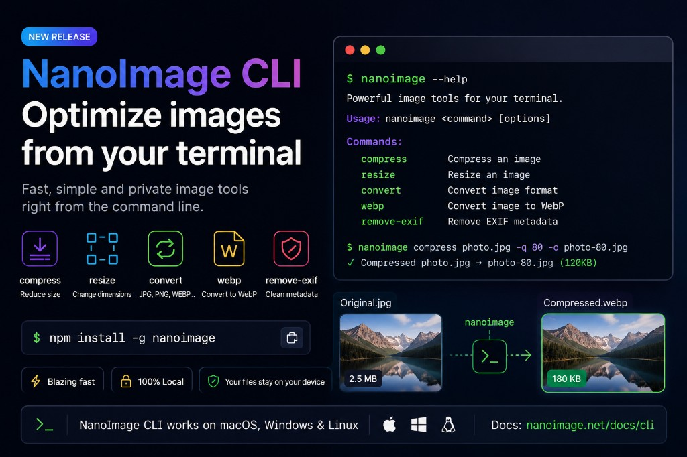

# NanoImage.net

Free online image tools and a developer CLI for everyday image workflows.

NanoImage helps you compress, resize, convert, crop, protect, and clean images directly in the browser. The CLI extends the same practical workflows to the terminal for batch processing and automation.



## Links

- Website: [https://nanoimage.net](https://nanoimage.net)
- CLI page: [https://nanoimage.net/cli](https://nanoimage.net/cli)
- CLI docs: [https://nanoimage.net/docs/cli](https://nanoimage.net/docs/cli)
- npm package: [nanoimage](https://www.npmjs.com/package/nanoimage)
- Blog post: [Introducing NanoImage CLI](https://nanoimage.net/blog/introducing-nanoimage-cli)

## Features

- Browser-based image tools with no account required.
- Client-side processing for core workflows whenever possible.
- Tools for compression, resizing, cropping, conversion, EXIF removal, blur, pixelation, watermarking, PDF creation, GIF creation, and video conversion workflows.
- Multi-language UI with automatic locale detection.
- SEO-friendly static pages, blog posts, metadata, Open Graph images, and sitemap.
- NanoImage CLI for local terminal workflows.

## NanoImage CLI

Install the CLI globally from npm:

```bash
npm install -g nanoimage
```

Check the installation:

```bash
nanoimage --help
```

### Commands

Compress images:

```bash
nanoimage compress ./images --quality 75 --output ./compressed
```

Resize images:

```bash
nanoimage resize hero.jpg --width 1200 --output ./resized
```

Convert formats:

```bash
nanoimage convert logo.png --to jpg --background white --output ./converted
```

Convert to WebP:

```bash
nanoimage webp ./public/images --quality 82 --output ./webp
```

Remove EXIF metadata:

```bash
nanoimage remove-exif ./photos --output ./clean
```

Use JSON output for CI/CD and automation:

```bash
nanoimage compress photo.jpg --quality 75 --json
```

## Project Structure

```text
app/                  Next.js App Router pages
components/           App shell and route wrapper
lib/                  SEO helpers
packages/cli/         Published nanoimage npm CLI source
public/assets/        Static images, brand assets, blog covers
src/App.tsx           Main UI and page components
src/App.css           Global and component styles
src/data.ts           Tool definitions and blog content
src/i18n/             Translations and locale detection
```

## Development

Install dependencies:

```bash
npm install
```

Start the local dev server:

```bash
npm run dev
```

Build the static site:

```bash
npm run build
```

Deploy to Cloudflare Pages:

```bash
npm run deploy
```

## Tech Stack

- Next.js 15 App Router
- React 19
- TypeScript
- CSS
- Cloudflare Pages
- Wrangler

## License

Private repository.
